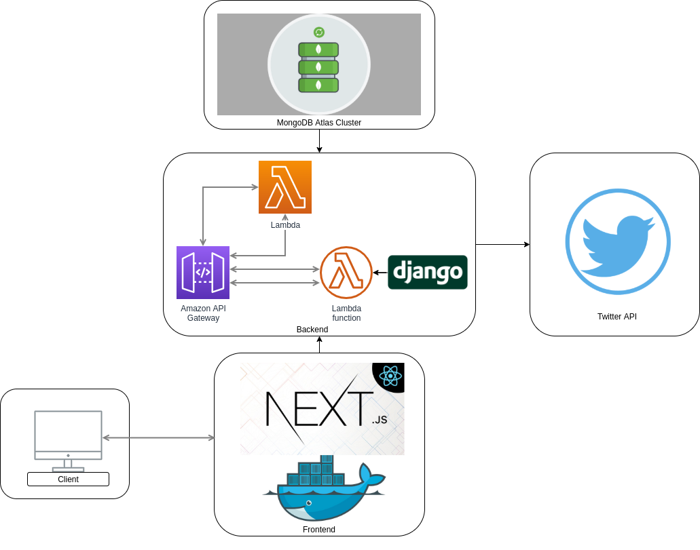

# Twitter Toplinks
Twitter Toplinks is project in which a twitter user can login and see analysis of their home timeline.

# Live on [Heroku](https://vishal-twitter-vouch.herokuapp.com)

# Tech Stack
 
 

* Next.js - for a cool frontend built on top of React
* Django - for a robust backend
* AWS Lambda and API gateway - To deploy the backend API (Django)
* Heroku - To deploy the frontend (Next.js)
* Docker - to make the application scalable and production ready

# Architecture


### The architecture is designed in a way that it gives best and fast experience to the user and saves cost too. The main purpose of using Lambda was to save the cost of servers running in the background unnecessarily, which has nowadays become a new norm for organizations to save cost and increase performance. MongoDB Atlas M10 cluster is used for performance and less throughput. The Next.js app is dockerized to make it platform independent and scalable in any environment. 

### Installation
Twitter Toplinks requires Node.js(Next.js) and Django to run locally.
You might have to change URI at some places to localhost if you want it to run on your machine. After cloning the repo install the dependencies and start the server.

```sh
$ cd backend/
$ pip install -r requirements
$ python manage.py runserver
```

For frontend

```sh
$ cd frontend/
$ npm i
$ npm run dev
```
### Please contact me on +91 8617686582 or 17ucs182@lnmiit.ac.in for any issues.
